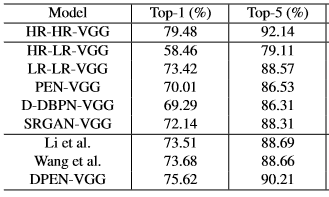

# APEN
Information Science submission

## Environment

> Python 3

> Pytorch 0.4.0

> torchvision 0.2.1

## Training

```python
python main.py
```
You will get trained models in model folder by default.

## Results

Accuracy comparisons of different LR image classification methods on Caltech-256:



